# POMOPET
> A text-based productivity app combining virtual pet simulation with a Pomodoro timer where users grow their pets by focusing

## Technologies Used
- C++

## Gameplay Mechanics / Cycle
### **Intro**
>Introduce game & ask user if they want to start new or load data
  - If the user chooses to load data, the file `data/pet.txt` is loaded and the values are inserted into variables. The file `data/petInventory.txt` is also loaded to input any equipment owned into the inventory

### **Display Pet Stats**
  > At start of session/focus cycle, display pet’s stats & an image of them 
### **Pet Training**
  > While on their 5-minute break, the user selects one of 4 skills to train during their 'focus' session
  -	Each location has its own skill & is derived from the Location class:
    - Forest (Strength)
    - Field (Speed)
    - Kitchen (Health)
    - Wishing Well (Luck)
      
  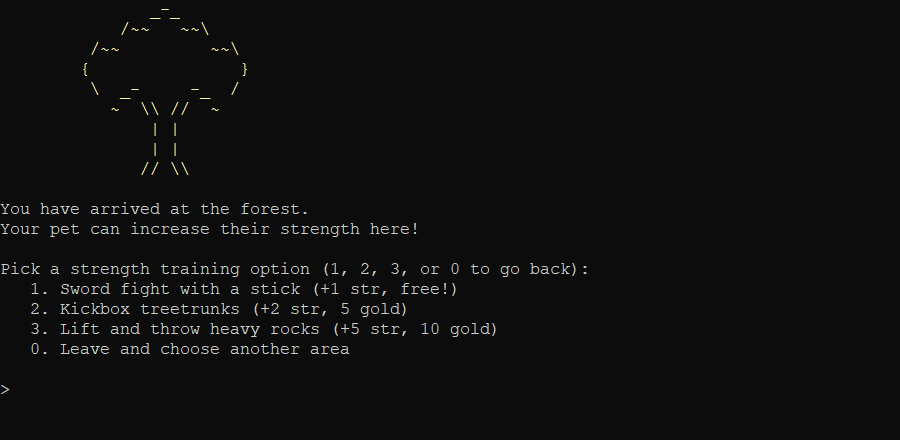 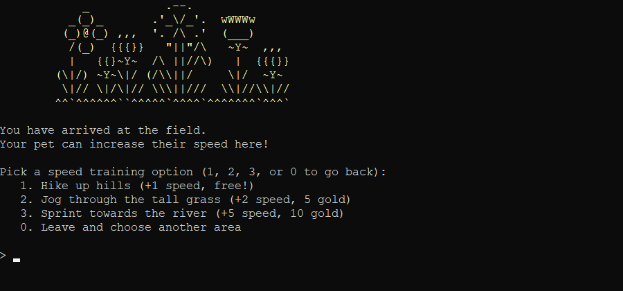 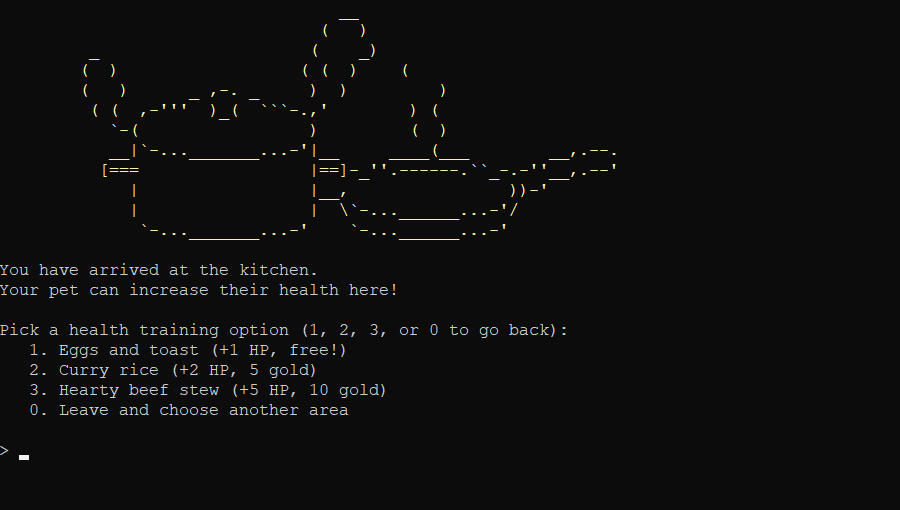 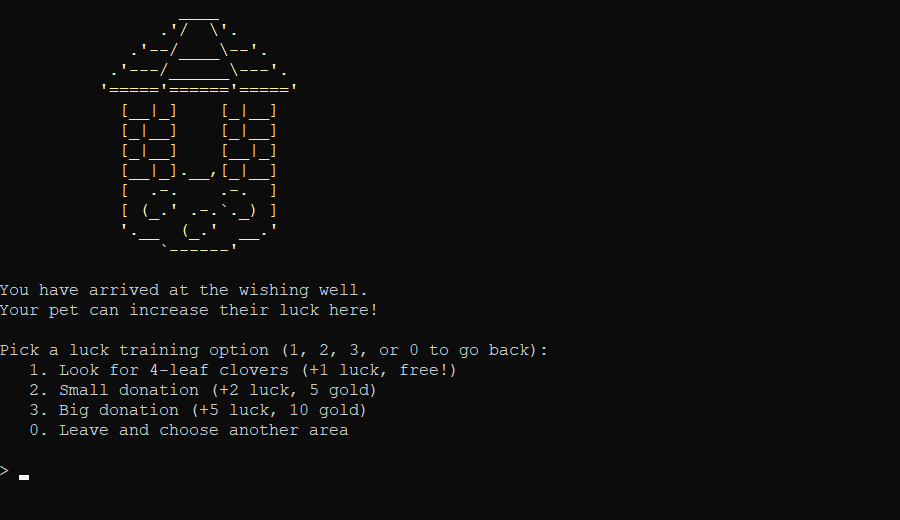
### **Pomodoro Timer**
  > 25-minute timer where the user 'focuses' and the pet 'trains'

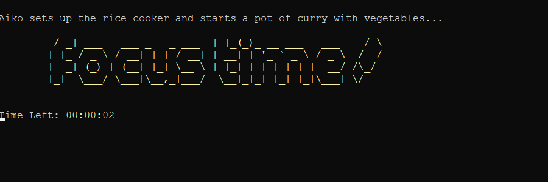

### **Updating Pet Data**
  > After each focus session, the pet's data is updated:
  - Gold added *(+1, +2, or +5; Luck stat increases chance of finding more!)*
  - Increase Pet's age *(age = number of focus sessions completed)*
  - Increase focus counter (keeps track of number of focus sessions done in current play session)
  - Use focus counter to check if it's time for long break *(activates when four focus sessions completed in current play session)*
### **Saving data**
  > At the end of the cycle:
  - Save pet data to `data/pet.txt`:
    - Gold
    - Four Stats (Strength, Speed, Health, Luck)
    - Number of battles won
    - Number of races won
    - training bonus
  - Save pet inventory to `data/petInventory.txt`
### **Restart Cycle**
  >Clear screen and return back to displaying pet stats

## Long Break Mechanics
> Once four focus sessions are completed in one play session, a long break *(10 minutes)* is allowed, opening up two more location options:

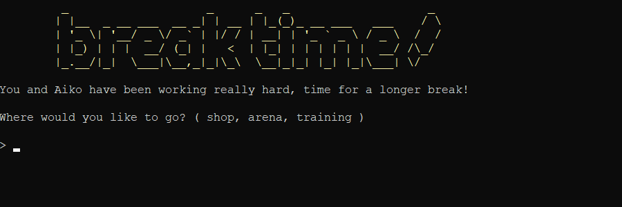

### **Shop**
  > Users can purchase consumable items and equipment

 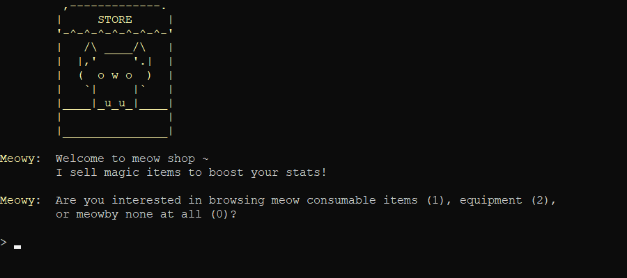

  - **Consumables**: There is one consumable item per stat, each cost 5 gold and give +3 skill points *(for said stat)*
  - **Equipment**: There is one equipment item per stat, each cost 50 gold and give +20 skill points *(for said stat)*
    - Equipment items also give a +1 bonus to all stats when training *(stackable up to 4 times = +4 bonus if all equipment purchased)*
    - Equpment items are **one-time purchases**. Once bought, they will be displayed in the inventory and removed from the shop
   
   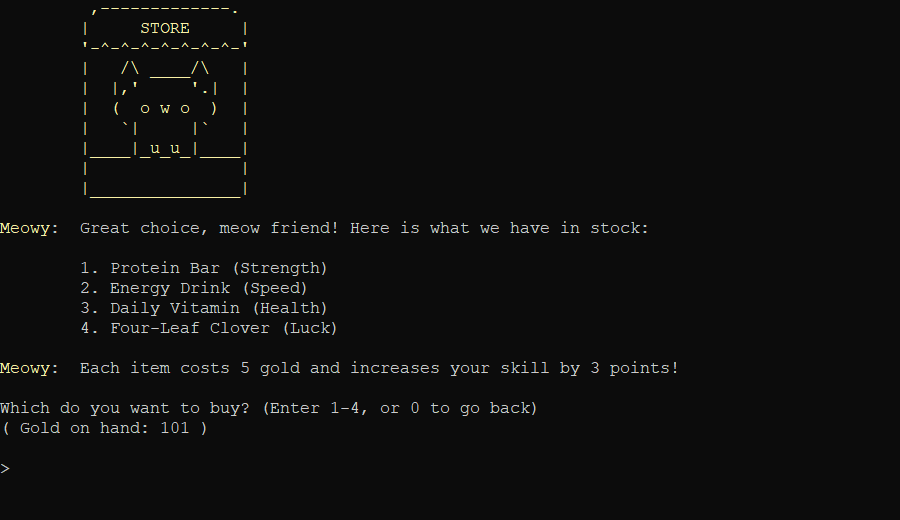 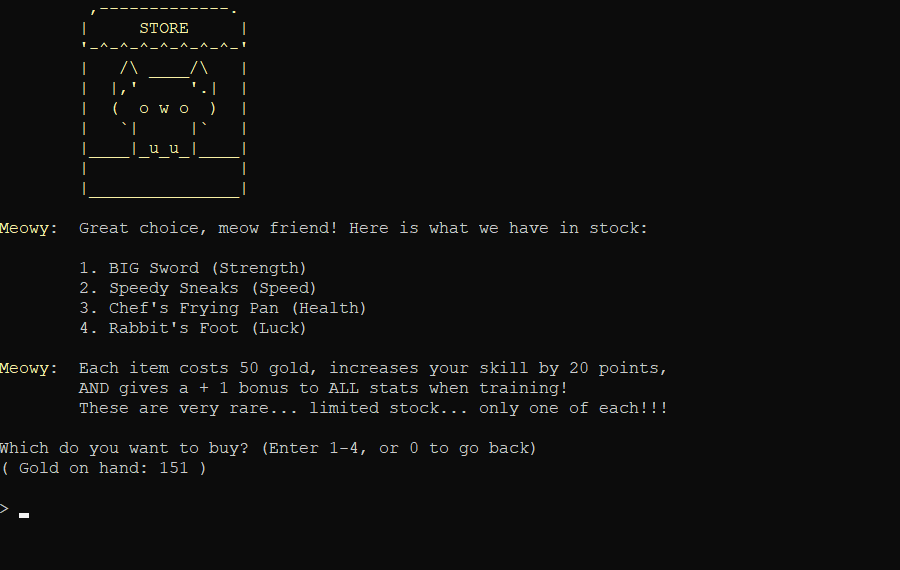
     
### **Arena**
  > Users can enter their pet in strength or speed challenges

  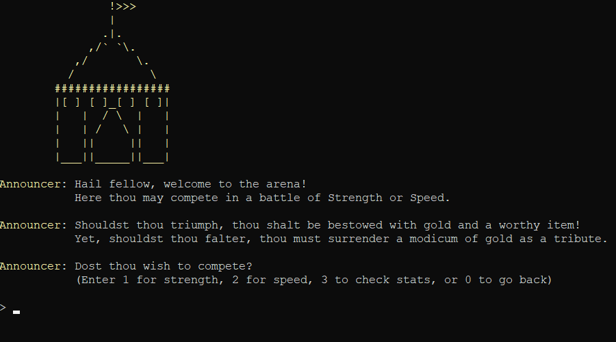

  - Challenges utilize dice-roll mechanics inspired by Dungeons & Dragons
    - Player pet and NPC "roll" a d20 *(aka get a random number from 1-20)* to determine damage done or distance ran
    - "Rolling" a 20 = a "Critical Success" which adds 5 to the final dice value
      
      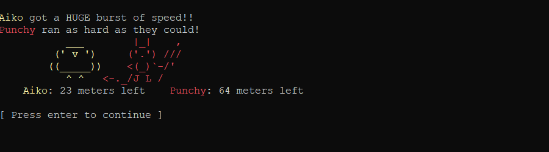
      
    - "Rolling" a 1 = a "Critical Failure" which turns the final dice value to 0 *(effectively losing a turn)*

      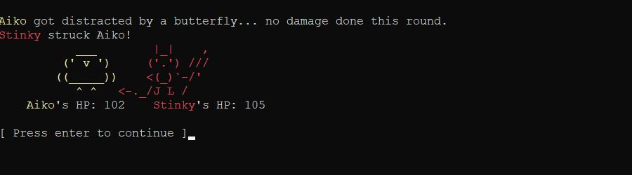
      
  - Enemy NPCs stats are randomized but balanced to be not too far off from the player pet
    - Each stat = player pet level / (2 through 4, randomly selected)
    - Each strength challenge won by the player pet = +3 strength and +2 health for the enemy NPCs
    - Each speed challenge won by the player pet = +3 speed and +2 luck for the enemy NPCs

    #### **Strength**

      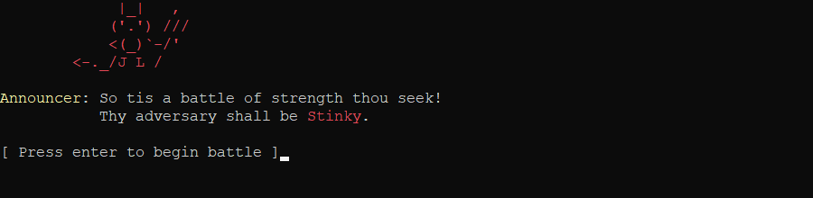

    - Each turn of combat, both the player pet and enemy NPC “roll” to determine damage and subtract that number from the other's health
      - Health = 100 + health stat
      - Damage = 1d20 + strength stat
    - Whoever's health is <= 0 first loses
      - In the case of a tie, the speed stat of the player pet and NPC will be the compared as the dealbreaker to see who 'hit first'
    
    #### **Speed**

      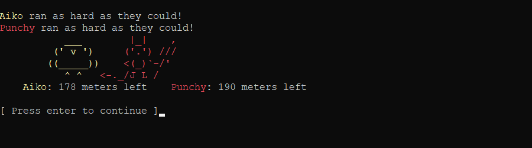
    
    - Each turn of the race, both the player pet and enemy NPC “roll” to determine distance ran and subtract that number from the starting distance
      - Starting Distance = 200 *(200m sprint)* + 200 for each race won
      - Distance Ran per Turn = 1d20 + speed stat
    - Whoever's health is <= 0 first loses
      - In the case of a tie, the strength stat of the player pet and NPC will be the compared as the dealbreaker to see who 'had the strength to hold on for the final sprint'

    #### **Reward System**
    - If the player pet wins, they receieve 5 gold and a random consumable item

      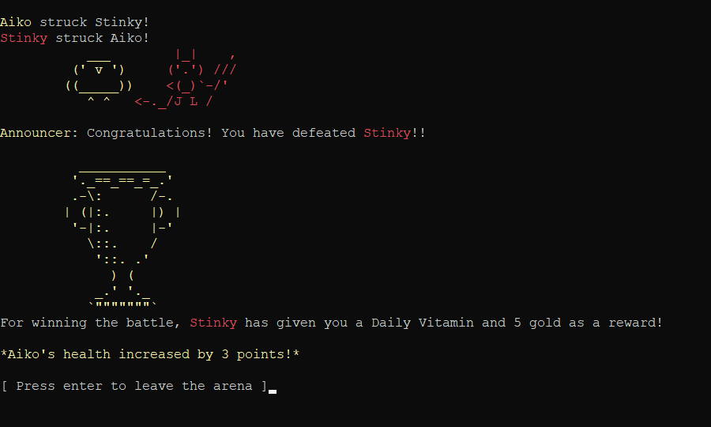

    - If the player pet loses, they give gold away. If they have...
      - 5 or more gold, they give 5
      - less than 5 gold, they give everything they have
      - 0 gold, they give none
