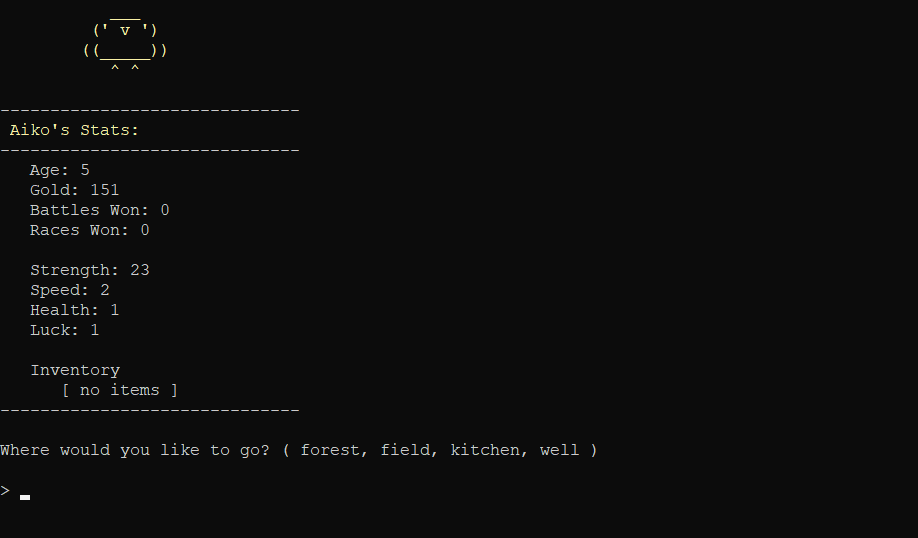

# PomoPet

A text-based productivity app that combines virtual pet simulation with a Pomodoro timer: complete focus sessions to grow your pet's stats, then on breaks choose where to train, and after four sessions unlock the shop and arena.

## Tech

- **C++** — Console app with ASCII art and ANSI colors. Save data in `data/pet.txt` and `data/petInventory.txt`.
- **Build & run** — Open `PomoPet.sln` in Visual Studio, build and run.

## Gameplay cycle

### Intro

Introduce game and ask user if they want to start new or load data.

- If the user chooses to load data, the file `data/pet.txt` is loaded and the values are inserted into variables. The file `data/petInventory.txt` is also loaded to input any equipment owned into the inventory.

### Display Pet Stats

At start of session/focus cycle, display pet's stats and an image of them.

### Pet Training

While on their 5-minute break, the user selects one of 4 skills to train during their focus session. Each location has its own skill and is derived from the Location class:

- Forest (Strength)
- Field (Speed)
- Kitchen (Health)
- Wishing Well (Luck)

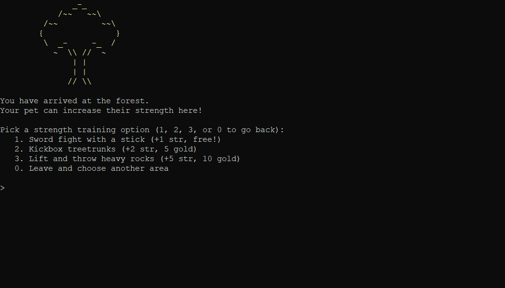 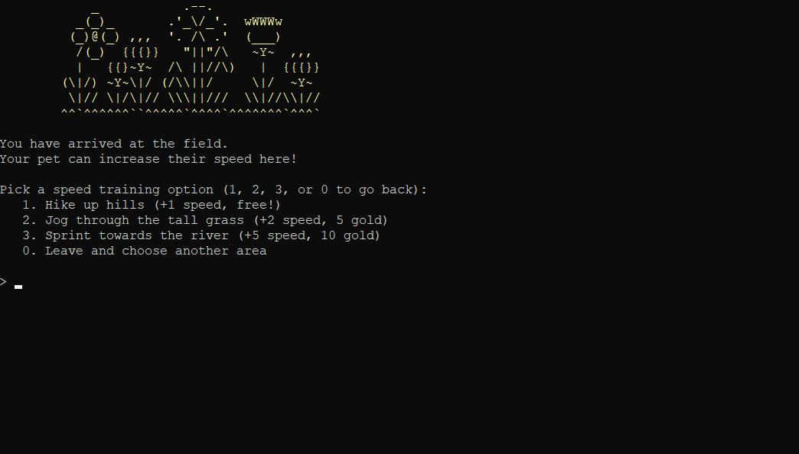 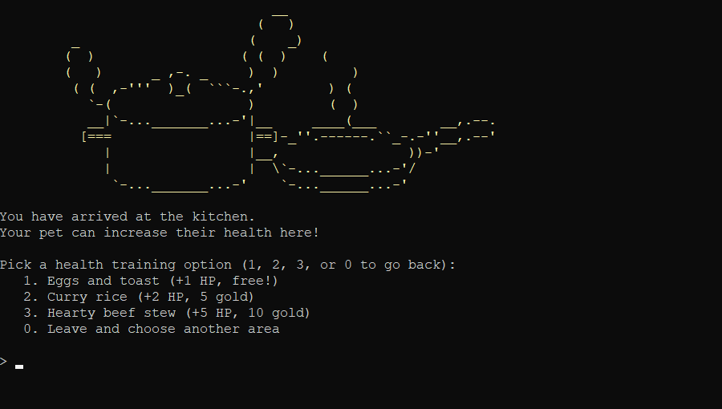 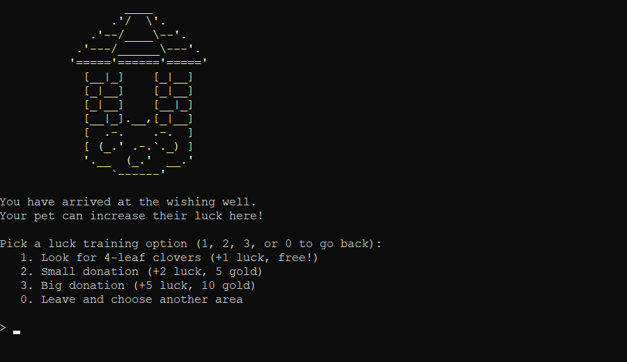

### Pomodoro Timer

25-minute timer where the user focuses and the pet trains.

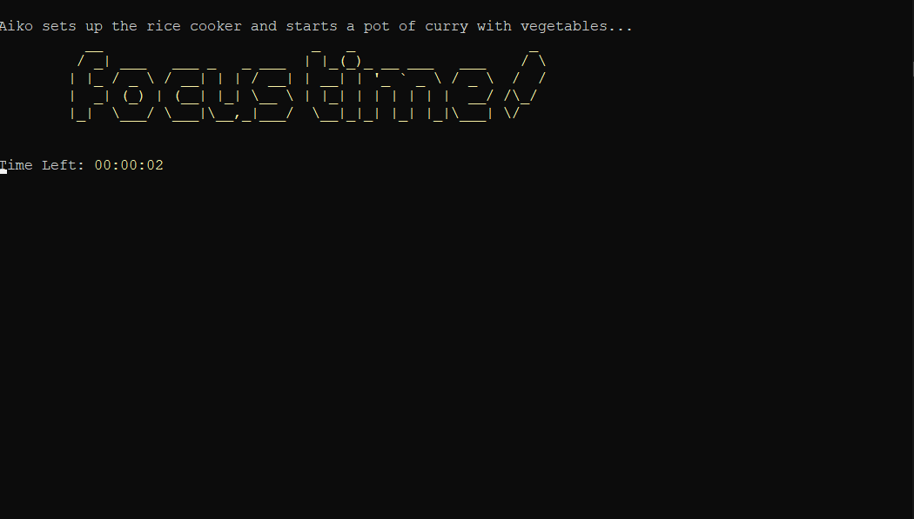

### Updating Pet Data

After each focus session, the pet's data is updated:

- Gold added (+1, +2, or +5; Luck stat increases chance of finding more!)
- Increase pet's age (age = number of focus sessions completed)
- Increase focus counter (keeps track of number of focus sessions done in current play session)
- Use focus counter to check if it's time for long break (activates when four focus sessions completed in current play session)

### Saving data

At the end of the cycle:

- Save pet data to `data/pet.txt`:
  - Gold
  - Four stats (Strength, Speed, Health, Luck)
  - Number of battles won
  - Number of races won
  - Training bonus
- Save pet inventory to `data/petInventory.txt`

### Restart Cycle

Clear screen and return to displaying pet stats.

## Long Break Mechanics

Once four focus sessions are completed in one play session, a long break (10 minutes) is allowed, opening up two more location options:

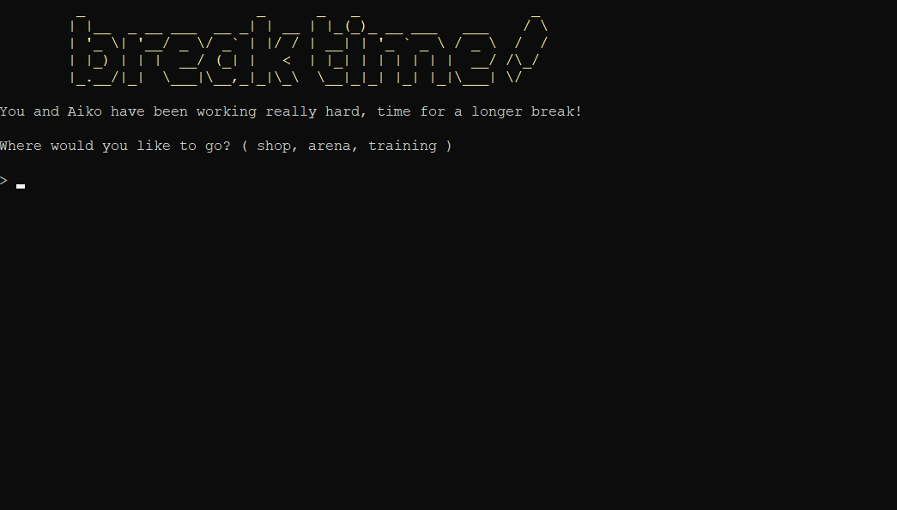

### Shop

Users can purchase consumable items and equipment.

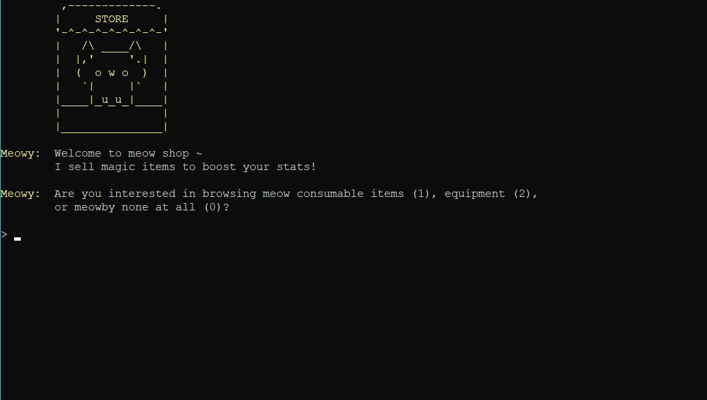

- **Consumables:** One consumable item per stat; each costs 5 gold and gives +3 skill points (for that stat).
- **Equipment:** One equipment item per stat; each costs 50 gold and gives +20 skill points (for that stat).
  - Equipment also gives a +1 bonus to all stats when training (stackable up to 4 times = +4 bonus if all equipment purchased).
  - Equipment items are **one-time purchases**. Once bought, they appear in the inventory and are removed from the shop.

### Arena

Users can enter their pet in strength or speed challenges.

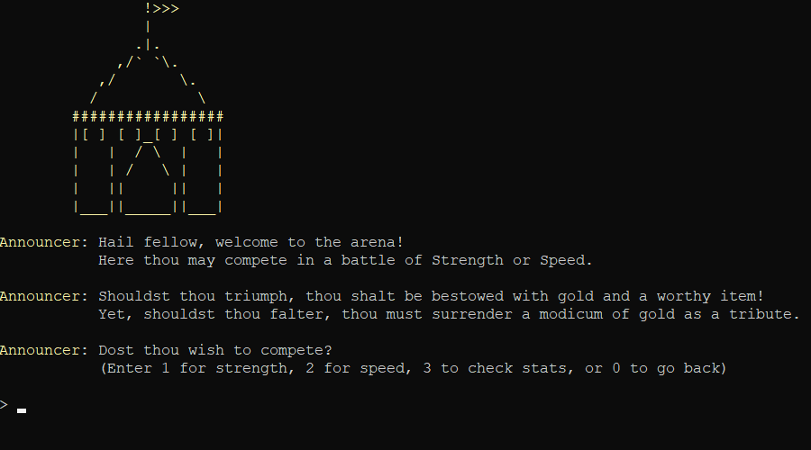

- **Dice mechanics (D&D-style):**
  - Player pet and NPC "roll" a d20 (random 1–20) to determine damage or distance run.
  - Rolling a 20 = Critical Success (adds 5 to the final dice value).
  - Rolling a 1 = Critical Failure (final dice value becomes 0, effectively losing a turn).
- **Enemy NPCs:** Stats are randomized but balanced relative to the player pet.
  - Each stat = player pet level / (2 through 4, randomly selected).
  - Each strength challenge won by the player = +3 strength and +2 health for enemy NPCs.
  - Each speed challenge won by the player = +3 speed and +2 luck for enemy NPCs.

#### Strength

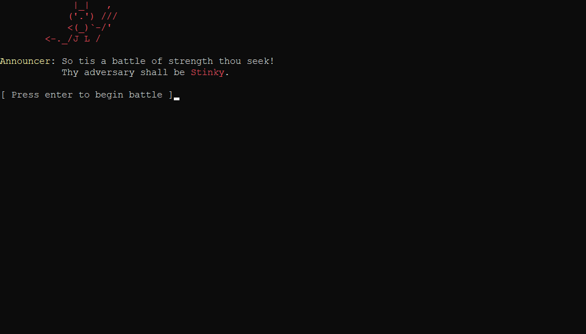

- Each turn of combat, both the player pet and enemy NPC "roll" to determine damage and subtract that number from the other's health.
  - Health = 100 + health stat
  - Damage = 1d20 + strength stat
- Whoever's health is ≤ 0 first loses.
- In the case of a tie, the speed stat of the player pet and NPC is compared as the dealbreaker to see who hit first.

#### Speed

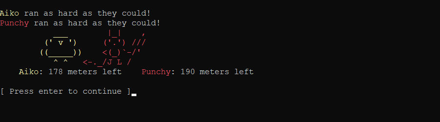

- Each turn of the race, both the player pet and enemy NPC "roll" to determine distance run; that value is subtracted from remaining distance.
  - Starting distance = 200 (200 m sprint) + 200 for each race won
  - Distance per turn = 1d20 + speed stat
- Whoever's remaining distance reaches 0 first wins; the other loses.
- In the case of a tie, the strength stat of the player pet and NPC is compared as the dealbreaker for the final sprint.

#### Reward System

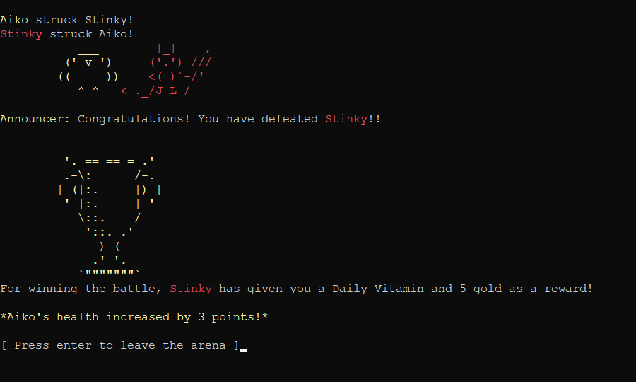

- **Win:** Player pet receives 5 gold and a random consumable item.
- **Lose:** Player pet gives gold away:
  - 5 or more gold → give 5
  - Less than 5 gold → give everything
  - 0 gold → give none
